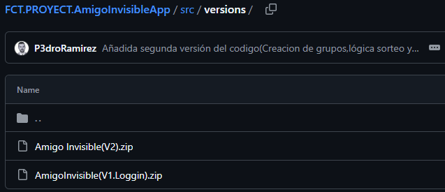
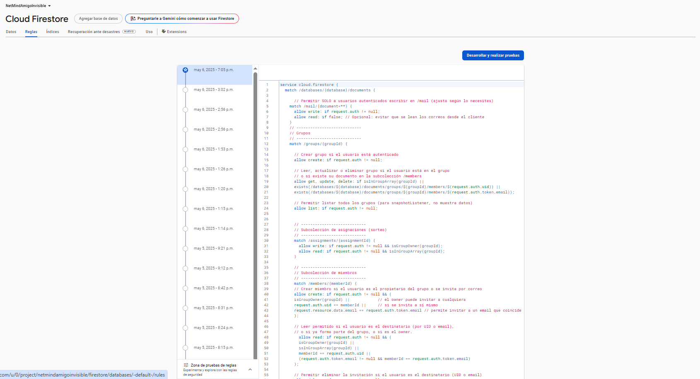

## 6.1 Manual de Instalación: Amigo Invisible

> *Este documento te guiará paso a paso en la instalación de la aplicación Amigo Invisible, tanto si eres un usuario que solo quiere usarla como si eres un desarrollador que quiere adaptarla.*

---

### ✅ Requisitos del Sistema

| Recurso               | Requisito mínimo                          |
| --------------------- | ----------------------------------------- |
| **Sistema Operativo** | Windows 10 / macOS 10.15+ / Ubuntu 20.04+ |
| **Android Studio**    | Versión 4.1 o superior                    |
| **Java JDK**          | Versión 11 o superior                     |
| **RAM**               | 8 GB recomendados                         |
| **Procesador**        | 4 núcleos                                 |
| **Espacio en disco**  | 20 GB libres                              |
| **Internet**          | Conexión estable                          |

---

### 🛠 Herramientas Necesarias

* [Android Studio](https://developer.android.com/studio)
* [Java JDK 11](https://www.oracle.com/java/technologies/javase-jdk11-downloads.html)
* Cuenta en [Firebase Console](https://console.firebase.google.com)
* (Opcional) Emuladores desde AVD Manager

---

### 📥 Descarga del Proyecto

📁 Repositorio GitHub: [AmigoInvisibleApp](https://github.com/P3droRamirez/FCT.PROYECT.AmigoInvisibleApp)

* Ve a la carpeta `src/versions`
* Descarga el archivo `.zip` más reciente
* Extrae el contenido y abre el proyecto en Android Studio con `File > Open`

📸 


---

### 🔗 Conexión con Firebase

1. Entra en [Firebase Console](https://console.firebase.google.com)
2. Crea un proyecto llamado "Amigo Invisible"
3. Activa **Cloud Firestore** en la sección *Database*
4. Copia las siguientes reglas de seguridad:

```js
rules_version = '2';
service cloud.firestore {
  match /databases/{database}/documents {

    match /users/{userId} {
      allow read, write: if request.auth != null && request.auth.uid == userId;
    }

    match /groups/{groupId} {
      allow read: if request.auth != null && request.auth.uid in resource.data.members;
      allow write: if request.auth != null && request.auth.uid == resource.data.owner;
    }

    match /groups/{groupId}/participants/{participantId} {
      allow read: if request.auth != null;
      allow write: if request.auth.uid == participantId;
    }

    match /groups/{groupId}/messages/{messageId} {
      allow read, write: if request.auth != null && request.auth.uid in get(/databases/$(database)/documents/groups/$(groupId)).data.members;
    }

    match /groups/{groupId}/wishlist/{wishId} {
      allow read: if request.auth != null && request.auth.uid in get(/databases/$(database)/documents/groups/$(groupId)).data.members;
      allow write: if request.auth != null && request.auth.uid == resource.data.owner;
    }
  }
}

```

5. Descarga `google-services.json` y colócalo en la carpeta `/app` del proyecto
6. Verifica el archivo `build.gradle` (App):

```groovy
apply plugin: 'com.google.gms.google-services'
```

Y en `build.gradle (Project)`:

```groovy
classpath 'com.google.gms:google-services:4.3.10'
```
📸 

---

### 🔧 Configuración de la App

```groovy
defaultConfig {
    applicationId "netmind.amigoinvisible"
    minSdk 26
    targetSdk 34
    versionCode 3
    versionName "1.2.0"
}
```

---

### 📲 Instalación en Dispositivo Android

1. Desde Android Studio:

   * `Build > Generate Signed Bundle / APK`
   * Elige **APK** o **AAB**
   * Usa tu clave `amigoInvisible-release-key.jks`
2. Copia el archivo al dispositivo o instala directamente desde Android Studio
3. Activa **Instalación de apps desconocidas** en el móvil

---

### 🧪 Pruebas de Verificación

* Inicia sesión (puede ser un registro nuevo)
* Crea un grupo y añade participantes
* Realiza el sorteo y prueba el chat
* Cambia el idioma del sistema: verifica que se traduce correctamente

📸 .png)


---

### 🚨 Solución de Problemas

| Problema                           | Solución                                                                     |
| ---------------------------------- | ---------------------------------------------------------------------------- |
| Error de Firebase                  | Verifica que `google-services.json` esté en `/app` y que el package coincida |
| App no instala                     | Activa "Fuentes desconocidas" en el móvil                                    |
| Error de autenticación             | Habilita **Auth por Email/Password** en Firebase                             |
| Cambios en Firestore no reflejados | Verifica reglas de seguridad de Firestore                                    |

---

### ❓ Preguntas Frecuentes (FAQ)

**¿Puedo usar la app sin configurar Firebase?**
✅ Sí, si usas la versión oficial generada por el desarrollador.

**¿Necesito saber programar para usar la app?**
❌ No, solo necesitas instalar el `.apk` en tu móvil.

**¿Puedo adaptar la app a mi gusto?**
✅ Sí, clona el repositorio, vincúlalo con tu propio Firebase y ¡modifícalo!

---

✨ *Este manual garantiza una instalación sin complicaciones, permitiéndote disfrutar de Amigo Invisible en minutos.*
